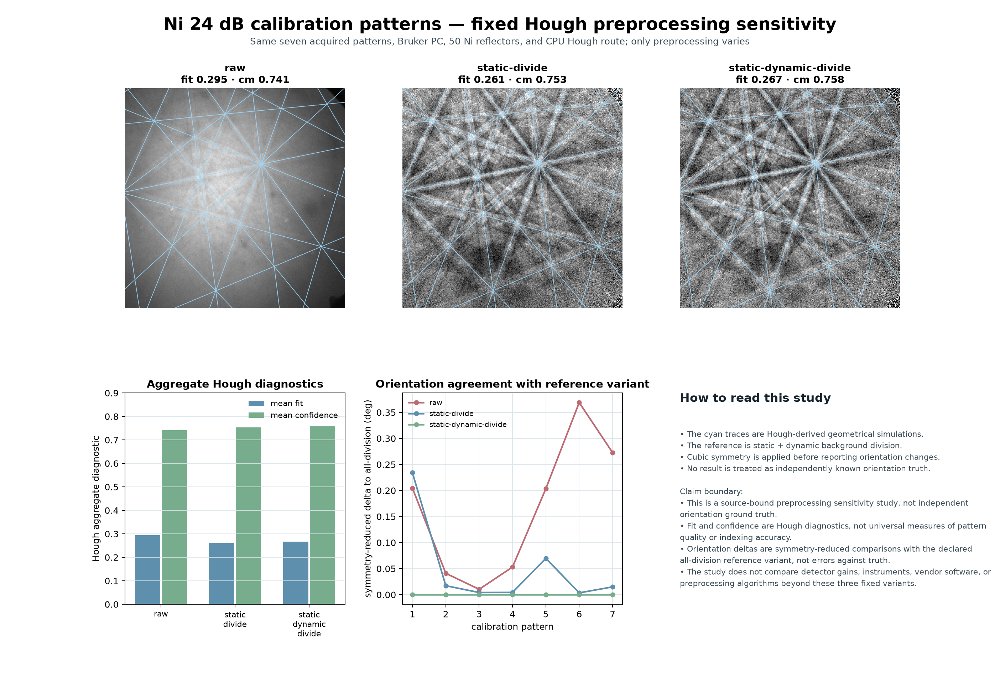

# Ni 24 dB preprocessing-sensitivity support study

Status: accepted **source-bound protocol comparison**, 2026-07-24.

## Decision

Release one compact sensitivity study alongside the Ni Reference Pack rather
than treating preprocessing as invisible implementation detail. The scope is
deliberately narrow: three named variants, the same seven calibration patterns,
fixed source/geometry/master/reflectors/Hough route, and a declared reference
variant for symmetry-reduced orientation comparisons.

## Acceptance checks

| Check | Result | Evidence |
|---|---|---|
| Same raw source | Pass | The runner verifies the existing 26-file source inventory before running. |
| Fixed model route | Pass | Bruker PC, 50 reflectors, Ni master, CPU PyEBSDIndex Hough route, and seven patterns are fixed by recipe. |
| Explicit variants | Pass | Raw, static division, and static-plus-dynamic division are pinned by recipe. |
| Rerunnable result | Pass | The runner verifies expected counts, Hough aggregates, and symmetry-reduced orientation deltas. |
| Honest interpretation | Pass | The report and figure label the comparison as source-bound protocol sensitivity, not truth or a general method ranking. |

## Result

All variants indexed 7/7 patterns. The measured aggregate Hough diagnostics
were raw `fit=0.294912`, `confidence=0.741434`; static division
`fit=0.261390`, `confidence=0.752934`; and static-plus-dynamic division
`fit=0.267316`, `confidence=0.757950`.

Relative to static-plus-dynamic division, cubic-symmetry-reduced orientation
changes remained small in this seven-pattern comparison: raw mean/max
`0.164918° / 0.368841°`; static-only `0.049757° / 0.234153°`.

## Reproduction

    uv run --with pyebsdindex==0.3.9.2 \
      python scripts/run_ni_gain24db_preprocessing_sensitivity.py \
      --output local/reference-packs/ni-gain24db-preprocessing-sensitivity-v0.1

The actual report records the input source-inventory identifier, linked
baseline-recipe digest, pinned runtime versions, per-pattern Hough values,
per-pattern symmetry-reduced deltas, result image, and output checksums.

## Nonclaims

- No independent orientations are known here.
- A Hough metric shift is not a general statement that one preprocessing
  method is scientifically or operationally superior.
- Nothing here establishes performance across detector gain, camera geometry,
  vendors, instruments, phases, or dictionary-indexing methods.
