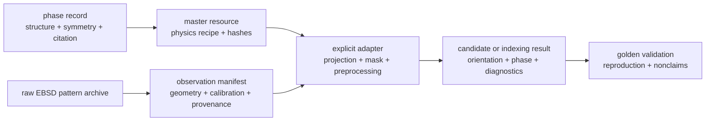

# Open Kikuchi Reference Pack: needs and gap review

- Status: research complete; implementation direction pending review
- Date: 2026-07-23
- Scope: identify a useful public scientific contribution before expanding the
  phase catalogue or starting a new indexing engine

## Question

What should Kikuchi Atlas contribute beyond a visually useful phase catalogue,
given established simulation and indexing tools, detector-specific dictionary
requirements, and emerging machine-learning approaches?

## Bottom line

Do not begin with a generic master-pattern library, a replacement indexing
engine, or a new trained model. The strongest candidate is an **Open Kikuchi
Reference Pack**: a small, reproducible package that binds an acquired or
source-provided EBSD pattern set to its detector observation model, phase and
master provenance, explicit processing/projection adapter, and a declared
baseline result.

The Atlas remains the approachable, visual entry point. A Reference Pack is
the machine-facing evidence layer beneath it; it is deliberately not a new raw
file format or an attempt to supplant upstream simulators.

## Existing capability and residual opportunity

| Existing capability | What it already covers | What Kikuchi Atlas should not duplicate |
|---|---|---|
| [kikuchipy](https://kikuchipy.org/en/stable/reference/generated/kikuchipy.simulations.KikuchiPatternSimulator.html) | Kinematical master patterns, detector projection, dictionary indexing, orientation/projection-centre refinement, and integration with Hough indexing | A second general-purpose kinematical simulator or indexing API |
| [EMsoft dictionary-indexing workflow](https://github.com/EMsoft-org/EMsoft/wiki/EBSD-Dictionary-Indexing) | Dynamical masters, detector fitting, and static or dynamic dictionary paths | A premature substitute for a mature dynamical workflow |
| [PyEBSDIndex](https://pyebsdindex.readthedocs.io/en/stable/user/index.html) | Hough/Radon indexing and NLPAR-oriented processing | A parallel generic Hough implementation |
| [h5ebsd](https://link.springer.com/article/10.1186/2193-9772-3-4) | Vendor-neutral archival EBSD HDF5 semantics for raw data, reference frames, and acquisition metadata | A competing EBSD container format |

The unfilled seam is not simulation alone. It is a portable, inspectable
answer to: *what exact observation was indexed, how was it mapped to the
reference resource, and what result should a different implementation recover?*

## What users actually need

| User or downstream project | Useful first deliverable | Why a master image alone is insufficient |
|---|---|---|
| Experimentalist re-indexing saved patterns | Raw patterns, calibration/geometry, preprocessing declaration, and a baseline result | The detector observation and preprocessing alter the comparable signal |
| Researcher with an uncommon phase | Cited structure, simulation recipe, master resource, and limits of use | A phase label without source and method provenance is not reproducible |
| Method developer | Inputs, held-out truth where available, metrics, masks, and a golden baseline | A visual pattern cannot test detector, frame, or preprocessing conventions |
| ML developer | Provenance-rich source/target splits and a stable evaluation contract | Training without a declared experimental domain invites simulation-to-experiment mismatch |

## Why detector-observation provenance is the core missing layer

Kikuchipy explicitly documents detector geometry, pattern centre, sample tilt,
pixel orientation, and conversion between vendor conventions in its
[reference-frame guide](https://kikuchipy.org/en/stable/tutorials/reference_frames.html).
EMsoft likewise distinguishes static precomputed dictionaries from dynamic
generation and notes that a static dictionary is appropriate only when detector
conditions are shared. Consequently, a public master pattern can be valuable,
but it is not by itself a portable indexing benchmark.

The current local Ice Ih work is a useful **synthetic reference implementation**
of this boundary: one canonical S2 resource is observed through named virtual
camera profiles and retains a per-profile mask. It is not acquired EBSD data,
an instrument-calibration claim, or a general accuracy benchmark.

## ML changes the order, not the need

Machine-learning indexing is an important future consumer, but not the first
artifact to build. The EBSD-CNN work by
[Ding, Pascal, and De Graef (2020)](https://www.sciencedirect.com/science/article/pii/S1359645420306510)
and later transfer-learning work by
[Shen et al. (2023)](https://www.sciencedirect.com/science/article/pii/S0927025623007127)
make the same practical point from a different direction: simulation and
experimental domains must be related deliberately. A small, highly declared
reference contract is more reusable than an unqualified model checkpoint.

## Candidate public-data starting points

| Candidate | Best role | Current decision | Required intake audit |
|---|---|---|---|
| Kikuchipy Ni gain/calibration and larger Ni map datasets | First source-bound calibration baseline candidate | Gates 1–5 passed locally; public release scope pending | Decide distributed raw data versus pointer, attribution, and whether independent orientation truth is required |
| Kikuchipy Si wafer dataset | Calibration/reference-frame fixture | Secondary candidate, not a broad indexing challenge | Confirm what orientation truth and detector semantics are exposed |
| [PyEBSDIndex simulation/Hough supporting data](https://journals.iucr.org/j/issues/2024/01/00/nb5367/nb5367sup1.pdf) | Independent simulated/Hough comparison fixture | Comparator only | Audit licensing, original metadata, and whether it can be redistributed as a fixture |

The available Kikuchipy data catalogue describes Ni and Si pattern datasets,
including calibration patterns, so it is a practical starting place for an
intake audit rather than a reason to announce a benchmark immediately.

## Proposed Reference Pack v0.1

One pack should include exactly these pieces:

1. Source-preserving raw-pattern archive or a durable, legal pointer to it.
2. Observation manifest: shape/binning, pixel convention, pattern centre,
   detector/sample geometry, masks, distortion/background/saturation policy,
   and provenance for unknown fields.
3. Phase record: composition, symmetry, structure source, and citations.
4. Master resource: simulator/source recipe, parameters, content hashes, and
   an explicit distinction between kinematical and dynamical products.
5. Adapter recipe: projection, coverage mask, normalization, and any
   preprocessing needed to compare observation and reference.
6. Golden validation: a named method configuration, expected candidate/result,
   diagnostics, and precise nonclaims.

### v0.1 non-goals

- Publishing a broad, unvalidated master-pattern database.
- Declaring an Ice Ih synthetic package an acquired-data benchmark.
- Reimplementing kikuchipy, EMsoft, or PyEBSDIndex.
- Promising vendor-import compatibility without a tested, documented format.
- Training or releasing a general indexing model.

## Promotion gate

Promote this incubator record into an implementation feature only when one
candidate dataset passes all of the following:

1. Its access and redistribution rights are clear.
2. Raw pattern values and source provenance are retained or durably reachable.
3. Detector geometry/calibration fields are present, or their absence is
   explicitly represented.
4. Phase and master resources are cited and reproducible.
5. At least one baseline method produces a versioned, rerunnable result.
6. The user approves the precise v0.1 pack boundary and its nonclaims.

## Recommended next decision

Authorize a bounded **Ni reference-pack intake audit** first. If it fails a
rights or metadata gate, evaluate the Si wafer as a calibration fixture and
the PyEBSDIndex data only as a non-production comparator. Defer an independent
engine and ML implementation until an actual reference pack exposes a bounded,
evidence-backed missing component.
