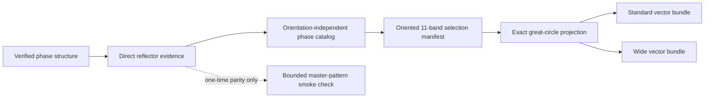

# Phase-General Direct-Reflector Art Series Design

**Status:** Approved in conversation on 2026-07-16
**Scope:** A direct, phase-general reflector seam and a ten-cell comparative
hemisphere-art family comprising the reviewed Ice Ih standard reference plus nine new
standard/wide figure bundles.

## Decision Summary

The schematic hemisphere art does not require a dense kinematical master-pattern
raster for every phase or every orientation. The production path will calculate
and retain the crystallographic reflector evidence directly, then rotate and
project exact plane normals as great-circle paths.

A bounded master-pattern calculation remains a one-time onboarding diagnostic.
It verifies that direct reflector evidence agrees with the established
kikuchipy/diffsims simulation boundary; it is not a routine rendering dependency.

The first comparative series uses one active crystal-to-sample Bunge ZXZ
orientation, `(17 degrees, 31 degrees, 43 degrees)`, across Ice Ih, forsterite,
alpha-quartz, zircon, and titanite. Each phase has an ordinary treatment and a
second treatment whose crystallographic arc widths are exactly `1.15x` the
ordinary widths. The 2.20 mm hemisphere boundary never widens.

## Goals

- Make phase-specific schematic Kikuchi art cheap to regenerate after a phase
  has been onboarded once.
- Preserve phase-specific structure factors, systematic absences, unit-cell
  settings, source provenance, and limitations.
- Keep reflector calculation independent of orientation, projection, and visual
  treatment.
- Make orientation an explicit, identity-bearing recipe value rather than a
  phase branch or hard-coded Python constant.
- Produce nine new complete vector-first figure bundles and one labeled
  comparison sheet.
- Retain the reviewed Ice Ih standard-reference geometry unchanged while deriving its
  wider companion from the same selected reflectors and centerlines.
- Bound every computation and expose its finite workload before it starts.

## Non-Goals

- Replacing the high-resolution kinematical or future dynamical master-pattern
  workflows.
- Claiming universal arbitrary-CIF support.
- Inferring band importance from crystal symmetry alone.
- Adding gray wash, dotwork, raster blur, inverse-depth treatment, detector
  realism, or 3D relief geometry.
- Producing an orientation gallery in this slice. The architecture must make a
  later gallery inexpensive, but the first series has one shared orientation.

## Product Matrix

The existing reviewed Ice Ih standard is the visual reference and is not regenerated or
overwritten. The slice adds the other nine cells:

| Phase | Standard treatment | Wide treatment |
| --- | --- | --- |
| Ice Ih | Existing reviewed reference bundle | New bundle |
| Forsterite | New bundle | New bundle |
| Alpha-quartz | New bundle | New bundle |
| Zircon | New bundle | New bundle |
| Titanite | New bundle | New bundle |

The comparison sheet contains all ten cells. Each new cell is a complete bundle,
not merely a PNG preview.

## Architecture



### 1. Verified phase sources

Every phase enters through the existing owned structure-record boundary. A
record must identify its source, license, checksum, unit-cell setting, sites,
occupancies, thermal-factor treatment, transformations, and known
approximations. The first series uses:

- the existing Ice Ih oxygen-sublattice record;
- the existing endmember forsterite `Mg2SiO4` record;
- a cited low/alpha-quartz `SiO2` record with its handed space-group setting
  stated explicitly;
- a cited stoichiometric zircon `ZrSiO4` record;
- a cited stoichiometric monoclinic titanite `CaTiSiO5` record with its setting
  stated explicitly.

Quartz, zircon, and titanite source selection is an implementation task, not a
license to choose an undocumented convenient CIF. A phase cannot proceed to art
generation until its source record passes the same structural validation used
by the existing phases.

For zircon, the retained COD 9000684 derivative changes only anisotropic
displacement tensors into explicitly documented isotropic values. Its atomic
coordinates remain in the COD-declared `I 41/a m d :2` origin choice. The
simulation record must then apply the International Tables choice-2 to
choice-1 fractional offset `[0, 1/4, -1/8]` because diffpy's numbered space
group 141 operators use choice 1. Expansion must prove the exact
`4 Zr + 4 Si + 16 O` conventional cell before reflector calculation.

For titanite, COD 9000509 supplies the 298.15 K synthetic `P 1 21/a 1`
structure. diffpy's numbered space group 14 uses standard `P 1 21/c 1`, so
the simulation record swaps source `a/c` and fractional `x/z`; the explicit
source and target symmetry translations must then agree exactly. If upstream
Cartesian point-group symmetrisation yields non-integer pseudo-HKLs for this
non-orthogonal cell, the direct path must expand exact reciprocal-index orbits
from the space-group fractional rotation matrices. It may not round those
pseudo-indices into claimed reflectors.

### 2. Direct reflector evidence

The existing adapter already enumerates reciprocal-lattice vectors and
calculates structure factors before it constructs a master simulator. That
pre-raster work becomes a public owned operation. It performs, in order:

1. enumerate reflectors down to the declared minimum d-spacing;
2. apply the supported centering/systematic-absence handling;
3. reduce and symmetrise with the declared crystal symmetry;
4. calculate structure factors with the declared scattering model;
5. apply the declared candidate threshold;
6. calculate Bragg angles at the declared beam energy;
7. collapse antipodal `+hkl/-hkl` partners into canonical axial bands; and
8. return project-owned immutable arrays and records rather than leaking
   upstream simulator objects.

Each member retains at least:

- canonical HKL;
- crystal-frame unit normal;
- d-spacing in angstrom;
- Bragg half-width in radians;
- structure-factor magnitude;
- normalized art weight;
- systematic-absence and threshold policy;
- structure, calculation-recipe, and software-version identities.

The first comparative series fixes one calculation policy for every phase:

| Input or rule | First-series value |
| --- | --- |
| Beam energy | 20.0 keV |
| Minimum d-spacing | 0.7 angstrom |
| Scattering parameters | `xtables` |
| Candidate floor | `abs(F_hkl) >= 0.03 * max(abs(F_hkl))` |
| Art weight | `(abs(F_hkl) / max(abs(F_hkl)))^2` |
| Art eligibility | normalized art weight `>= 0.08` |

These values match the established Ice/forsterite kinematical and Ice art-band
policies. A phase-specific relaxation is not automatic fallback behavior: it
requires evidence, a revised recipe identity, and renewed design approval.

No dense stereographic, Lambert, detector, or spherical intensity array is
created on this production path.

A fully versioned migration of every phase from reviewed upstream Cartesian
orbits to one canonical exact fractional-index engine is parked until after the
first comparison series. It will require new evidence identities and explicit
parity review even when plotted geometry changes only below visual precision.

### 3. Phase catalog boundary

Art-band catalog construction will consume a small reflector-evidence contract,
not a `PresentationSource` that also requires a master raster. Compatibility
adapters may continue to accept an existing presentation source, but direct and
raster-backed callers must converge on the same owned evidence fields and
catalog semantics.

The phase catalog is orientation-independent. Its identity changes when the
structure, beam energy, minimum d-spacing, scattering model, reflector
threshold, weighting rule, or relevant software boundary changes. It does not
change when the Bunge angles, projection, artboard, or stroke treatment changes.

### 4. Composition and selection

A composition recipe references one phase catalog and declares:

```yaml
orientation:
  convention: active-crystal-to-sample
  representation: bunge-zxz
  degrees: [17, 31, 43]
selection:
  count: 11
  tier_counts: [4, 4, 3]
  redundancy_threshold_deg: 4.0
  coverage_sectors: 6
  score_weights:
    strength: 0.40
    angular_width: 0.15
    nonredundancy: 0.20
    coverage: 0.15
    zone_relationship: 0.10
```

For a crystal-frame normal `n_crystal`, projection uses
`n_sample = R * n_crystal`, where `R` is the active crystal-to-sample Bunge ZXZ
rotation. No camera-only rotation and no transform of a finished 2D image may
stand in for this operation.

Selection is deterministic, tie-aware, and phase-sensitive. It rejects
forbidden, vanishing, inadequately resolved, or duplicate axial bands; then it
selects exactly 11 defensible members while balancing normalized strength and
useful projected angular distribution. The selection is checked against the
wider stroke envelope before it is frozen. Four members receive the dominant
tier, four the secondary tier, and three the fine tier.

The first series also retains the existing `721` great-circle samples, `0.90`
crop radius, and 6 degree zone-interior margin. Standard tier widths are
`[4.8, 4.2, 3.6, 3.1]` mm, `[2.5, 2.2, 1.9, 1.6]` mm, and
`[1.2, 1.0, 0.8]` mm in selection order. These shared constants are recipe data,
not hard-coded phase behavior.

The reviewed Ice Ih standard selection manifest is authoritative for the new
Ice wide derivative. It must not be silently reselected. For each other phase,
one frozen selection manifest supplies both treatments.

### 4.1 Scientific migration amendment (2026-07-17)

Quartz onboarding exposed an incompatible non-orthogonal coordinate-frame
handoff between orix phase alignment and diffsims unit-cell expansion. The
corrected adapter expands each asymmetric site through orix's alignment-aware
owner, validates the declared per-site multiplicity, and assigns one exact
intensity magnitude across every point-symmetry/Friedel family before any
threshold. This correction changes Ice structure factors and catalog/member
identities; old calculated IDs must not be reused for corrected content.

The retained reviewed Ice standard remains immutable, presentation-only legacy
evidence. Its exact 11-plane visual decision is migrated through a versioned
canonical-HKL manifest recording ordered HKLs, orientation, tier, width, and
legacy identity links. Corrected Ice production must prove every reviewed HKL
remains present and eligible, bind it to the corrected member ID, prohibit
automatic reselection, include the manifest snapshot in the new bundle, and
publish new selection/geometry/run identities. Legacy validation loads the
retained artifact directly rather than regenerating malformed physics.

Changing orientation later creates a new composition and selection identity and
reruns only lightweight selection/projection. It does not repeat phase source
onboarding, structure-factor calculation unless its inputs changed, or master
rendering.

### 5. Vector-first treatments and rendering

The renderer constructs exact spherical great circles from rotated plane
normals, projects them into the complete stereographic hemisphere, and clips
the crystallographic stroke layer to the established inner disc. It then draws
the noncrystallographic outer boundary last.

Shared physical geometry remains:

- artboard: 145.0 mm square;
- outer hemisphere diameter: 132.0 mm;
- outer boundary width: 2.20 mm;
- crystallographic clipping radius: 63.8 mm;
- background treatment: black ink plus untouched skin/white only.

The standard treatment uses the reviewed reference tier widths. The wide treatment
multiplies every crystallographic arc width by exactly `1.15`; it does not alter
centerline coordinates, selected reflector IDs, projection, artboard, clipping,
or outer boundary. True crystallographic crossings remain allowed. Blur,
soft-focus operations, raster-derived edges, artificial nodes, and decorative
fine centerlines remain prohibited.

## Artifacts and Identity

Every new treatment bundle publishes atomically with:

- canonical SVG;
- canonical PDF;
- high-resolution PNG preview;
- geometry JSON with centerlines and physical widths;
- frozen selected-reflector manifest;
- phase-catalog snapshot or content-identified reference;
- structure and calculation provenance ledger;
- composition and treatment recipes;
- validation report and scientific-claim disclaimer; and
- top-level content manifest.

Every non-test scientific or visual computation is a retained product. Its
content-identified directory remains under
`local/phase-general-direct-reflector-art/` (or an explicitly recorded legacy
reference root) and is not deleted or silently replaced after inspection. The
acceptance record indexes each retained catalog, parity report, preview,
comparison sheet, vector/geometry bundle, and later derived model with its
exact command, recipe/source IDs, manifest ID, and checksums. Ephemeral pytest
temporary directories are verification scaffolding rather than products.

The labeled comparison sheet is a review derivative. It identifies phase,
treatment, orientation, and bundle ID for every cell and never replaces the
individual canonical artifacts.

## Parity Diagnostic

Direct-reflector parity is tested against the established simulator boundary,
not against subjective pixel similarity. Ice Ih and forsterite must prove that
the direct path matches the simulator's pre-master selected reflector inventory,
canonical normals, Bragg angles, and structure-factor evidence within declared
numeric tolerances.

Quartz, zircon, and titanite each receive one bounded smoke master calculation
after structural onboarding. The smoke result is retained as onboarding
evidence. Once parity passes, normal art generation must make zero master-pattern
calls.

A parity mismatch, unsupported setting, insufficient defensible reflector pool,
or source ambiguity is a phase failure. The workflow may retain successfully
verified phase bundles and diagnostics, but it must report the series as
incomplete and must not publish a falsely complete failed-phase bundle.

## Finite-Work and Failure Contract

Before each phase begins, the workflow reports the phase, enumerated reflector
limit, expected simulation count, treatment count, and deadline. Every stage
logs start, finish, elapsed time, and retained failure diagnostics.

The routine production path has `simulation_count = 0`. Onboarding parity has
`simulation_count = 1` per new phase and may not retry, widen its deadline, or
increase master resolution automatically. Rendering operates transactionally
per bundle: temporary outputs either pass validation and publish together or
remain explicitly incomplete diagnostics.

## Verification

### Unit tests

- Direct evidence preserves exact HKL, normal, d-spacing, Bragg angle,
  structure-factor, and weight channels.
- Antipodal collapse is canonical and deterministic.
- Source, calculation, catalog, composition, selection, and treatment identity
  boundaries change only for their declared inputs.
- Direct production rejects or detects any master-pattern call.
- Active Bunge rotation is numerically verified and leaves the phase catalog
  unchanged.
- Standard and wide manifests contain identical selected member IDs and
  centerline coordinates; arc widths differ by exactly `1.15x` and boundary
  width remains exactly 2.20 mm.
- Tie handling and the `4/4/3` assignment are deterministic.

### Integration tests

- Ice Ih and forsterite direct evidence passes simulator-boundary parity.
- Each newly onboarded phase passes structural validation and one bounded parity
  smoke before production rendering.
- All nine new bundles have finite geometry, exact physical dimensions, complete
  inventories, valid content identities, and no crystallographic ink outside
  the permitted disc tolerance.
- A repeated run from identical inputs reproduces identical catalog, selection,
  recipe, geometry, and bundle identities.
- The comparison sheet references the reviewed Ice standard and all nine new
  bundle IDs.

### Visual acceptance

The ten-cell comparison sheet is the primary review surface. Acceptance checks
that phase differences remain legible, the 15 percent widening is slight but
visible, the hierarchy remains coherent, and no output introduces blur or
unrequested fine linework. Scientific validation and visual preference remain
separate gates.

## Acceptance Criteria

- A project-owned direct-reflector path produces phase catalogs without dense
  master arrays and passes parity against the existing simulator boundary.
- Quartz, zircon, and titanite are onboarded from cited, checksum-verified,
  setting-explicit structures.
- One shared configurable active Bunge orientation drives all first-series
  projections.
- Four new standard bundles and five new wide bundles publish with complete
  vector, raster-preview, geometry, catalog, and provenance artifacts.
- Each standard/wide pair uses identical reflectors and centerlines, with only
  the crystallographic widths scaled by `1.15`.
- The existing reviewed Ice standard reference remains unchanged.
- A ten-cell labeled comparison sheet is retained for user review.
- Every real non-test product is retained locally and indexed with sufficient
  command, identity, recipe, source, and checksum evidence to reproduce it.
- All finite-work, determinism, containment, parity, and bundle-validation tests
  pass before the series is presented as complete.
