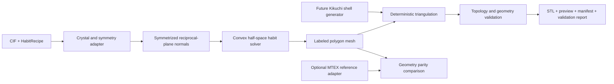

# Crystal Habit Mesh Generator Design

## Purpose

Generate reproducible, unit-aware, watertight meshes of idealized crystal
habits from a CIF plus an explicit set of crystallographic face families and
relative face distances. Quartz is the first reference specimen, not a
hard-coded special case. The production path is Python-native; MTEX 6.1.1 is
an optional geometry reference and never a runtime requirement for ordinary
users.

This product represents an idealized convex crystal morphology. It is not an
atomic model, a unit cell, a natural crystal-growth simulation, or a Kikuchi
intensity surface. The first accepted mesh is process-neutral. Advisory FDM
observations may use the user's FlashForge AD5X workflow as a practical check,
but printer behavior does not own or silently alter the scientific geometry.

## Decisions

1. The canonical input is a human-editable `HabitRecipe`, serialized as YAML.
2. The CIF provides lattice, phase, and symmetry identity. It does not imply a
   crystal habit; the recipe explicitly supplies face families and distances.
3. Recipe distances are positive support distances from the origin, expressed
   in relative units before final millimetre normalization.
4. MTEX normal multipliers are an interchange convention, not the canonical
   data model. Because an MTEX `Miller` plane normal retains reciprocal-vector
   magnitude, its support distance is `dspacing / normal_multiplier`, followed
   by any common normalization shared by all families.
5. The production generator is Python-native and uses project-owned plain-data
   contracts. MTEX is an optional parity oracle.
6. The first geometry class is a single convex half-space intersection. Boolean
   assemblies, twins, intergrowths, cavities, bases, text, and surface relief
   are outside this feature.
7. STL is the required first mesh export. Face provenance remains authoritative
   in the sidecar manifest; richer 3MF grouping is a later additive export.
8. Mesh validation is mandatory and does not perform silent repair.
9. The shared scale, triangulation, validation, export, and provenance spine is
   intentionally reusable by a later Kikuchi globe generator.
10. The Kikuchi globe requires a separate reviewed design because mapping a
    directional scalar field to printable shell displacement is a distinct
    scientific and geometric problem.

## Scientific Model

A face family is identified by Miller indices in either three-index `hkl` or
four-index `hkil` notation. The phase adapter obtains the reciprocal-lattice
plane normal and expands it under the crystallographic point group. Each
expanded unit normal `n_i` and positive support distance `d_i` defines a closed
half-space:

```text
dot(n_i, x) <= d_i
```

The idealized habit is the bounded intersection of all such half-spaces.
Polygon faces and vertices are derived from that intersection. A requested
family may be mathematically valid but inactive when other planes completely
truncate it; inactivity is preserved as a diagnostic rather than treated as a
solver failure.

The canonical polygon mesh retains, for every visible face:

- source face-family identifier and label;
- source Miller indices and index convention;
- expanded symmetry-equivalent plane identity;
- unit Cartesian normal in the recorded crystal frame;
- relative support distance; and
- ordered vertex indices.

Triangulation derives a triangle mesh without replacing the labeled polygon
mesh as the scientific geometry contract.

## Habit Recipe

The approved quartz reference recipe has this semantic shape:

```yaml
schema: kikuchi.habit-recipe/v1
phase:
  cif: quartz.cif
habit:
  index_convention: hkil
  faces:
    - {family: [1, 0, -1, 0], relative_distance: 0.5091702048436217, label: m}
    - {family: [1, 0, -1, 1], relative_distance: 1.0, label: r}
    - {family: [0, 1, -1, 1], relative_distance: 1.1111111111111112, label: z}
    - {family: [2, -1, -1, 1], relative_distance: 0.9557191976124586, label: s1}
    - {family: [6, -1, -5, 1], relative_distance: 0.7545681549701853, label: x1}
geometry:
  maximum_dimension_mm: 60.0
exports:
  - stl
```

These support distances reproduce the user's MTEX normal multipliers
`[2.5, 1.0, 0.9, 0.7, 0.3]` for MTEX's quartz CIF. Each value is first computed
as `dspacing / multiplier`, then all values are divided by the `r`-family value
so `r = 1`. This preserves the reciprocal-lattice magnitude that a simple
multiplier reciprocal would incorrectly discard. The conversion and resulting
distances are recorded in the reference ledger. The loader rejects ambiguous
mixed index conventions, non-finite values, non-positive distances, duplicate
labels, and a missing or invalid target dimension. An optional orientation
rotates the completed crystal-frame habit into a named output frame before
final export.

Recipe identity includes normalized recipe content, CIF bytes, relevant solver
and tolerance settings, coordinate-frame metadata, and software versions.
Paths alone never establish phase or artifact identity.

## Architecture and Data Flow



### Crystal and symmetry adapter

This component owns CIF parsing, lattice and point-group identity, Miller-index
validation, reciprocal-plane normals, symmetry expansion, deduplication, and
coordinate-frame metadata. It exposes project-owned arrays and identifiers,
not durable third-party crystallography objects.

### Habit solver

The solver converts labeled planes to half-spaces, proves boundedness, computes
vertices, orders face polygons, records active and inactive planes, and emits a
single labeled convex polygon mesh. Numerical tolerances are expressed relative
to normalized habit diameter and recorded in the manifest.

### Mesh spine

The mesh spine scales geometry to explicit millimetres, triangulates planar
polygons deterministically, verifies topology and orientation, writes mesh and
inspection products atomically, and records hashes. It depends only on plain
geometry contracts and can therefore serve both the habit solver and a later
spherical-shell generator.

## MTEX Reference Contract

The reference adapter recreates the approved MTEX construction, extracts
`crystalShape.V` and `crystalShape.F`, removes per-face `NaN` padding, and emits
a plain-data reference ledger. Volume is recomputed from the extracted closed
polyhedron rather than trusting the convenience `crystalShape.volume` property.
It targets the locally validated MTEX 6.1.1 workflow but is not imported by the
Python package.

Parity is geometry-level rather than byte- or triangle-order-level. After both
habits are normalized to unit maximum dimension, acceptance requires:

- the same set of visible labeled Miller families;
- equal vertex and polygon-face counts after tolerance-aware deduplication;
- bidirectional vertex Hausdorff distance no greater than `1e-7`;
- relative volume difference no greater than `1e-6`; and
- corresponding outward face-normal angular difference no greater than
  `1e-7` radians.

The comparison records all measured residuals. A failed comparison preserves
both ledgers for diagnosis and does not weaken tolerances automatically.

## Artifact Contract

One successful quartz build writes an atomic artifact directory containing:

| Artifact | Requirement | Role |
| --- | --- | --- |
| `quartz-habit.stl` | Required | Binary, millimetre-scaled, single-solid triangle mesh. |
| `quartz-habit-preview.png` | Required | Fixed-view visual inspection product with labeled face-family legend. |
| `habit-manifest.json` | Required | Recipe/CIF identity, frames, symmetry expansion, visible and inactive faces, scale, versions, triangle-to-face provenance, and hashes. |
| `mesh-validation.json` | Required | Bounds, volume, topology, orientation, degeneracy, intersection, and advisory feature observations. |
| `mtex-parity.json` | Reference acceptance run | MTEX version, reference identity, parity tolerances, measurements, and pass/fail result. |

STL coordinates are written numerically in millimetres even though STL has no
standard unit metadata. The manifest is authoritative for units. A future 3MF
export may retain face-family groups and appearance, but must derive from the
same accepted polygon and triangle meshes.

Generated meshes and large previews are run artifacts rather than committed
source. The recipe, compact reference ledgers or fixtures, tests, and acceptance
evidence belong in git.

## Failure and Diagnostic Behavior

The build fails before export when:

- the CIF does not establish a valid lattice or crystallographic symmetry;
- indices do not match the declared convention;
- a distance or scale is invalid;
- symmetry expansion yields no usable planes;
- the selected half-spaces are empty or do not enclose a bounded solid;
- tolerance-sensitive degeneracy prevents a stable polygon mesh;
- triangulation is non-manifold, inconsistently oriented, or zero-volume; or
- the requested output cannot be written atomically.

Inactive face families, small facets, acute tips, narrow dimensions, and likely
support-sensitive orientations are warnings when the solid remains valid. FDM
observations use configurable nozzle and layer-height context and never modify
the mesh. The system does not silently merge scientific faces, blunt tips,
thicken parts, add a base or supports, fill cavities, or invoke generic mesh
repair to force acceptance.

Every diagnostic names the affected family, plane, face, edge, or triangle when
that identity is available.

## Validation and Testing

The test ladder is:

1. Analytic cube and hexagonal-prism fixtures with known normals, symmetry,
   dimensions, topology, and volume.
2. Three-index and four-index parsing, reciprocal-plane-normal, symmetry
   expansion, and coordinate-frame tests.
3. Empty, unbounded, redundant, duplicate, near-coplanar, and invalid plane
   collections.
4. Deterministic polygon ordering and triangulation tests.
5. Exact mesh invariants: one connected component, every edge incident to two
   triangles, consistent outward winding, positive finite volume, no duplicate
   or zero-area triangles, and no unintended self-intersections.
6. Recipe/CIF identity and artifact-hash reproducibility tests.
7. Quartz geometry parity against MTEX using the stated tolerances.
8. A manual slicer smoke check in the user's FlashForge AD5X-oriented workflow,
   recorded as practical evidence rather than canonical geometry truth.

Final scaling must produce a maximum mesh dimension of `60.0 mm` within
`1e-8 mm`. The validation report records the actual axis-aligned bounds and does
not infer manufacturability solely from watertightness.

## Acceptance Contract

`KIKU-F004` is accepted when:

1. An arbitrary conforming CIF and habit recipe can enter the Python-native
   pipeline without quartz-specific code paths.
2. The committed quartz recipe reproducibly emits the complete artifact bundle.
3. The required STL passes every canonical mesh invariant and has a `60.0 mm`
   maximum dimension.
4. The quartz polygon geometry passes the MTEX parity contract.
5. Inactive faces and FDM-oriented observations appear as labeled diagnostics
   without changing the geometry.
6. A slicer smoke check opens the STL as one solid and records any orientation
   or support observations.
7. Existing planar, detector, spherical-intensity, and milestone contracts are
   unchanged.

## Explicit Non-Goals

- Deriving equilibrium or growth morphology from CIF chemistry.
- Atomic, molecular, bond, or unit-cell models.
- Non-convex crystals, twins, intergrowths, aggregates, cavities, or Boolean
  assemblies.
- Bases, stands, sprues, supports, labels, holes, or printer-specific repair.
- Colored or multi-material printing in the first accepted slice.
- Mapping Kikuchi intensity or diagrammatic bands onto the habit.
- Generating the spherical Kikuchi relief globe in this feature.
- Changing the exceptional-forsterite milestone or its acceptance products.

## Future Seam: Kikuchi Globe

After the mesh spine is accepted, a separate design may map a validated
directional scalar field or diagrammatic band field to a spherical shell using
an explicit base radius, shell thickness, relief function, angular resolution,
minimum feature policy, and topology contract. That product will share scaling,
triangulation, mesh validation, export, hashing, and provenance infrastructure
with this feature while retaining separate scientific semantics.
